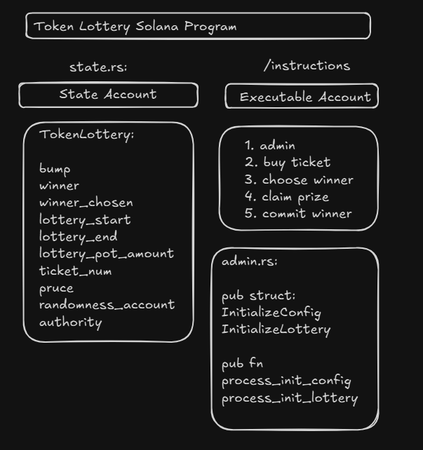

# Token Lottery:

- Your program is a Solana smart contract (Anchor program) for a Token Lottery, where users can buy NFT tickets
- A winner is chosen randomly using a Switchboard randomness oracle. It uses Anchor + Switchboard + Metaplex SPL NFTs.

1. Initialize Config → Setup the lottery parameters (start, end, price, authority).
2. Initialize Lottery → Setup a Metaplex NFT collection for lottery tickets.
3. Buy Ticket → Users pay SOL and receive NFT tickets.
4. Commit Winner → Admin commits a randomness account from Switchboard.
5. Choose Winner → Admin calculates the winning ticket based on randomness.
6. Claim Prize → Winner can claim SOL pot using their winning ticket NFT.

